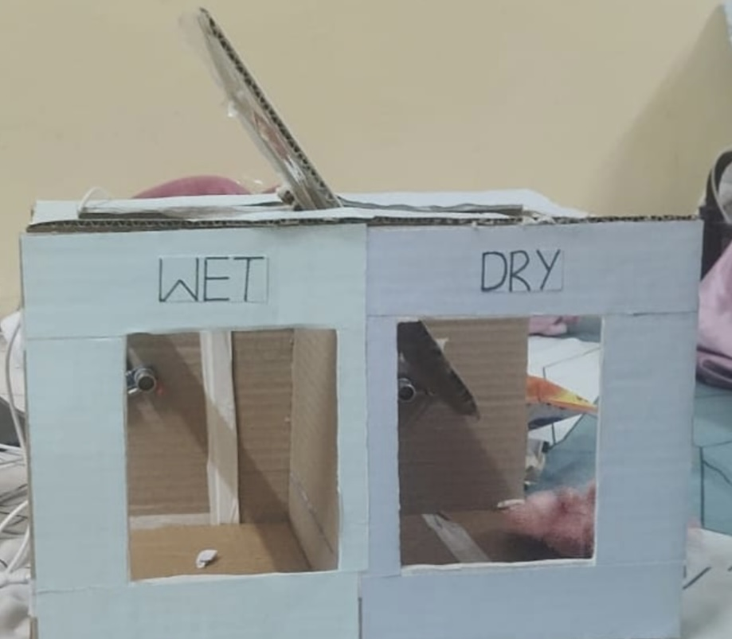
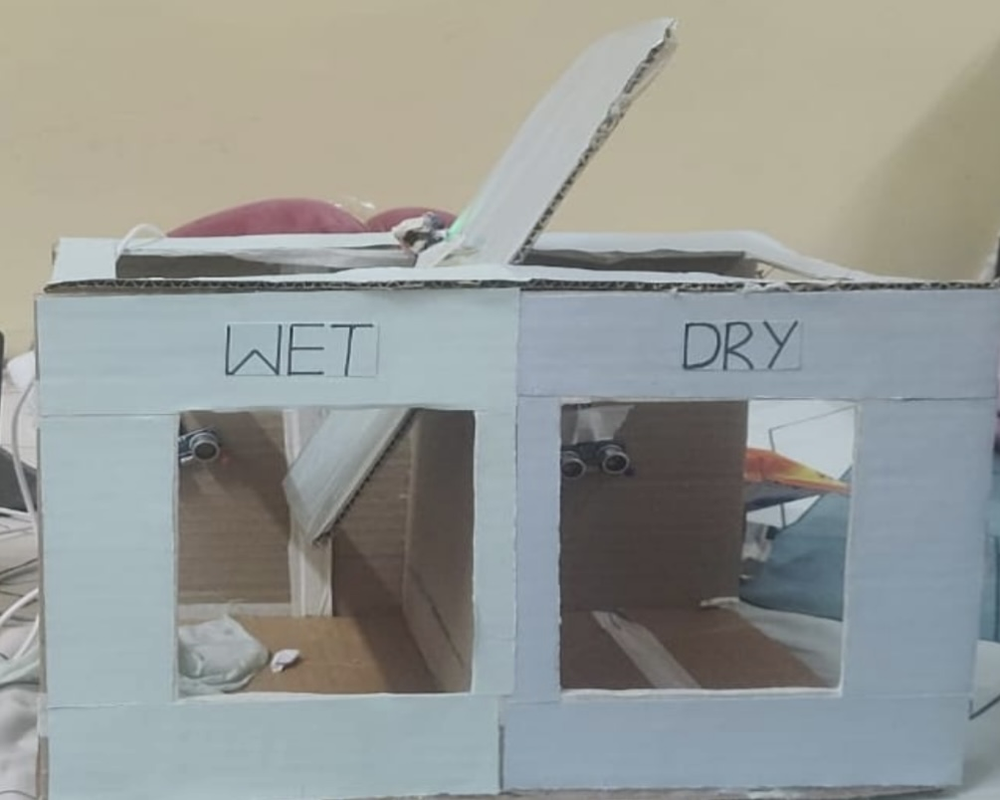
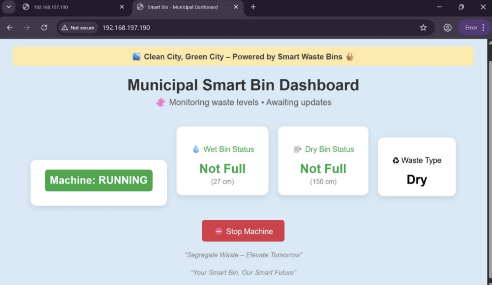
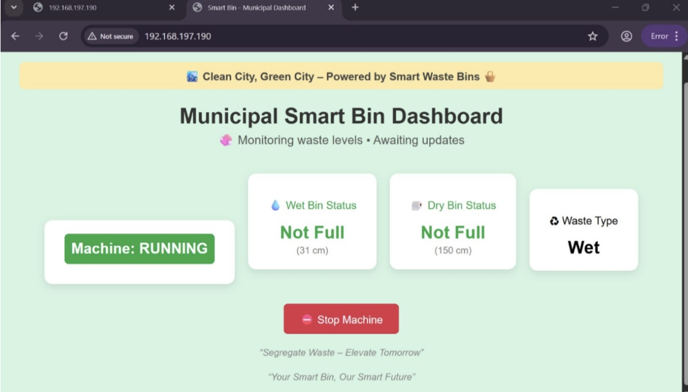
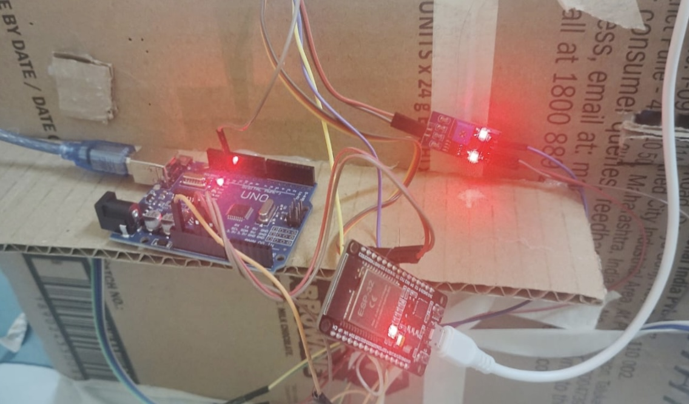

Smart Waste Bin

An IoT-based Smart Waste Bin designed to automate waste segregation and monitor bin fill levels in real time using ESP32 and multiple sensors.

Features

- Automatic wet and dry waste classification
- Real-time bin fill level monitoring
- ESP32-based control system
- Servo-controlled waste routing
- Local web dashboard for monitoring
- Cost-effective IoT solution

## ⚙️ How It Works

1. The IR sensor detects when waste is placed near the bin.
2. The moisture sensor determines whether the waste is wet or dry.
3. The ESP32 processes the sensor data.
4. The servo motor directs the waste into the appropriate compartment.
5. Ultrasonic sensors monitor the fill level of each bin.
6. A local dashboard displays the waste type and bin status in real time.

## 🛠️ Hardware Components

- ESP32 Development Board
- Ultrasonic Sensors
- IR Sensor
- Moisture Sensor
- Servo Motor

## 💻 Software Used

- Arduino IDE
- Embedded C++

Project Structure

```
smart-waste-bin/
│── code/
│── images/
│── docs/
└── README.md
```

My Contribution

- Contributed to ESP32 programming and sensor integration.
- Assisted in implementing waste classification logic.
- Participated in hardware assembly, testing, and debugging.
- Contributed to documentation and project development.

## 📸 Project Preview

### Working Model - Dry Waste


### Working Model - Wet Waste


### Dashboard - Dry Waste


### Dashboard - Wet Waste



### Circuit Diagram


Project Report

The complete project report is available in the folder.
